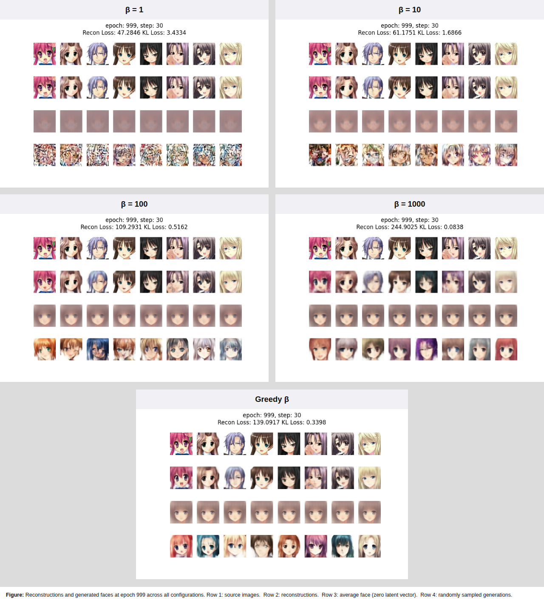
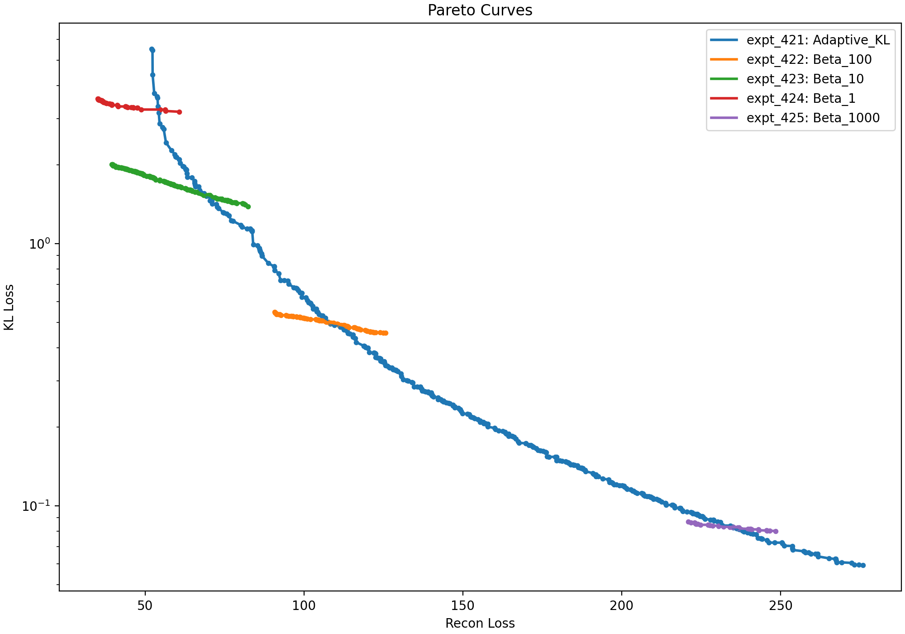
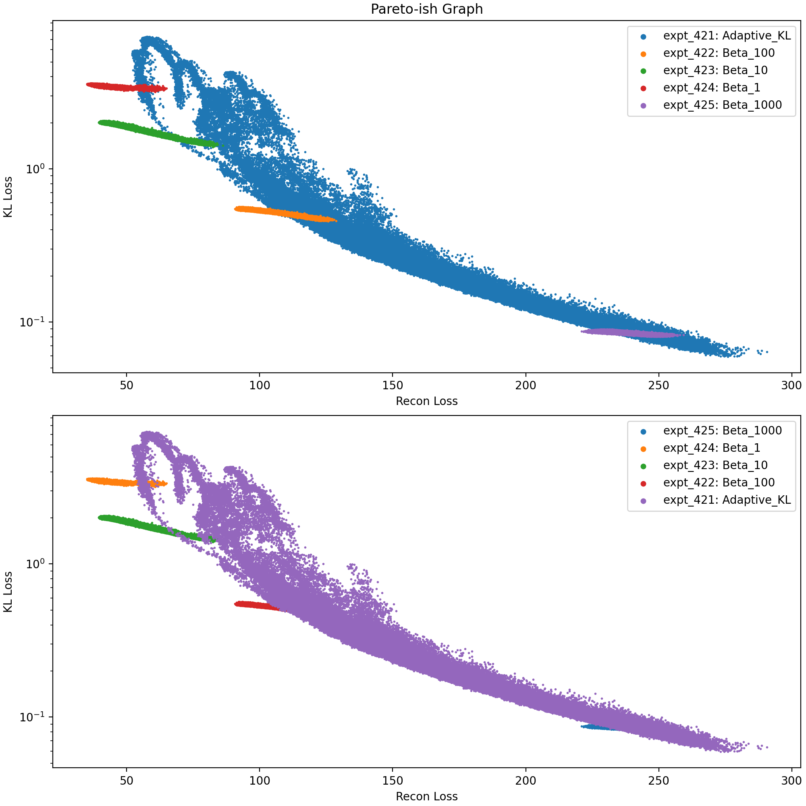
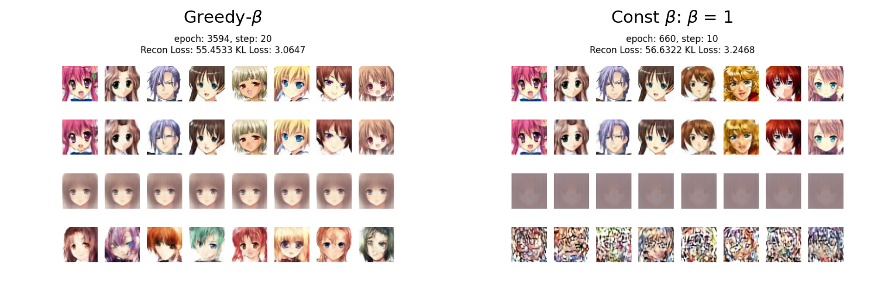
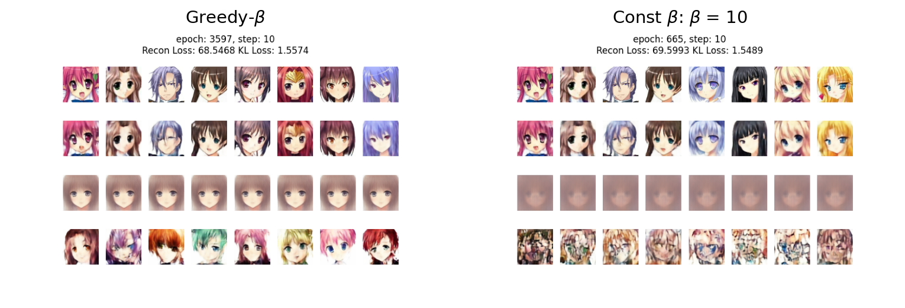
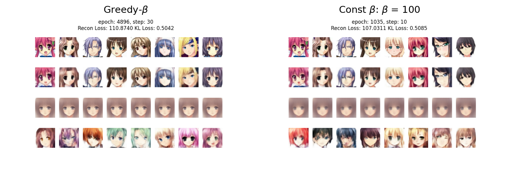
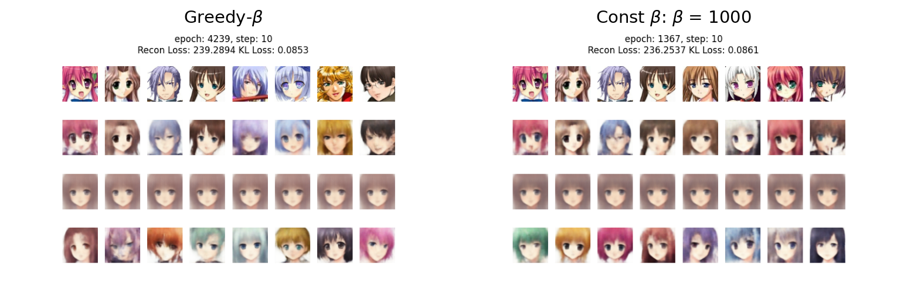

# Anime VAE Test Bed: Constant-β vs Adaptive Greedy-β Training

## Overview
This repository is a Variational Autoencoder (VAE) test bed to study how Kullback-Leibler (KL)-weighting strategy affects image reconstruction quality, generation quality, and reconstruction-KL tradeoffs.

VAEs optimize two competing objectives: a reconstruction term, which encourages faithful reconstructions, and a Kullback-Leibler (KL) term, which encourages the latent distribution to remain close to a prior. In this project, the raw reconstruction loss is typically much larger than the raw KL term, and the observed training dynamics suggest that without explicit KL upweighting, optimization tends to prioritize reconstruction improvement over latent regularization.

One way to mitigate this is to multiply the KL loss term by a constant parameter, β, to adjust the relative importance of each term. 

The current focus of this project is comparing fixed-β VAEs against a hand-tuned adaptive “greedy beta” controller that tries to maximize β while still reducing reconstruction loss.

These regimes are compared using Pareto frontiers in reconstruction-KL space, side-by-side visual comparisons of reconstructions and generated samples, latent-origin decodes (`z = 0`), and training movies that show how model behavior evolves over time.

A key question is whether an adaptive KL-weighting strategy can discover better tradeoff regions than fixed-β baselines at comparable points on the reconstruction-KL frontier. More broadly, the project treats β not just as a static hyperparameter, but as a control variable whose training dynamics can change the region of the reconstruction-KL frontier that the model explores.


## Core Questions
1. Can a greedy β strategy reach better reconstruction-KL tradeoffs than fixed-β baselines?
2. Does greedy β training explore a broader or differently shaped frontier than constant-β training?
3. Does greedy β training reach strong reconstruction and generation behavior more quickly than constant-β training?
4. What kinds of training dynamics emerge when β is allowed to vary continuously?
5. When Pareto frontiers intersect, does the greedy regime produce visibly better generated samples?

## Current Training Modes
The project currently supports two training modes, which differ in how they manage the relative importance of the reconstruction and KL loss terms. This is done by multiplying the KL loss term by a scalar, β.

### Constant-β VAE
Constant-β VAEs use a constant value of β for the entire training run. The larger β is, the more emphasis is placed on reducing the KL loss, typically pushing the model toward stronger latent regularization. The special case β = 1 corresponds to the standard VAE objective.


Constant-β runs provide the baseline reference points for this project. By training separate models at different fixed values of β, the project measures how static KL weighting changes reconstruction behavior, generation quality, and the shape of the reconstruction-KL Pareto frontier.

### Adaptive Greedy-β Controller
As an alternative to requiring a user to choose an appropriate value of β, this project also implements a hand-tuned adaptive controller. Its goal is to maximize the reduction of the KL loss term by increasing β, while still reducing the reconstruction loss.

Rather than committing to a single value of β for the full run, the greedy controller adjusts β dynamically during training in response to model behavior. This allows the model to move through reconstruction-KL space over time, rather than remaining tied to a single fixed-β regime.

The current controller is heuristic rather than theoretically optimized. It is included as an experimental mechanism for studying whether dynamic KL weighting can discover better tradeoff regions, faster training progress, or qualitatively better generated samples than constant-β baselines.


## Pareto Frontier Analysis

Because the VAE jointly optimizes reconstruction loss and KL loss, model behavior is better described by a tradeoff region in reconstruction-KL space than by any single scalar loss value alone. In this project, that tradeoff is summarized using the Pareto frontier.

A point belongs to the Pareto frontier if no other observed point has both lower reconstruction loss and lower KL loss. Equivalently, each point on the frontier represents a non-dominated tradeoff: improving one objective would require worsening the other.

For each training run, the project extracts the Pareto frontier from the set of observed reconstruction-KL pairs over time. This provides a compact way to compare different training regimes, not just by their final losses, but by the range of tradeoffs they discover during training.

In practice, the Pareto frontier is used alongside reconstructed images, generated samples, and latent-origin decodes (`z = 0`) to compare constant-β and adaptive greedy-β VAEs. This helps distinguish regimes that may achieve similar scalar losses but differ in the regions of reconstruction-KL space they explore and in the visual quality of their outputs.

## Current Results
### Image Comparisons
<p align="center">
  
</p>
The figure above compares fixed-β VAEs with β = 1, 10, 100, and 1000 against the adaptive greedy-β VAE after 1,000 training epochs.

The β = 1 and β = 10 models reconstruct well, but generate poorly. The β = 100 model can produce some of the best individual samples, but its outputs remain inconsistent and occasionally fail badly. The β = 1000 and adaptive greedy-β models produce the strongest generation results overall, with substantially better consistency than the lower-β models.

The reconstruction comparison between β = 1000 and adaptive greedy-β slightly favors the adaptive model, which preserves some fine details more faithfully and achieves a lower reconstruction loss. The generation comparison is less clear-cut. Because generation quality depends on both reconstruction behavior and latent regularization, the lower reconstruction loss of the adaptive model and the lower KL loss of the β = 1000 model pull in opposite directions. On visual inspection, neither model is clearly superior.


### Pareto Comparisons
<p align="center">
  
</p>

The VAE objective contains two terms that measure different model behaviors. As a result, performance is better characterized by a curve in two-dimensional loss space than by a single scalar value. Because generated-image quality depends on both reconstruction behavior and latent regularization, Pareto frontiers are used here to summarize the best observed reconstruction-KL tradeoffs for each training regime.

The figure above shows that the constant-β VAEs have relatively short Pareto frontiers that are close to horizontal, with a slight negative slope. As β increases, these frontiers shift down, toward lower KL loss, and to the right, toward higher reconstruction loss. That is consistent with the expected effect of increasing KL pressure.

In contrast, the adaptive greedy-β run traces out a frontier that appears parabolic and covers a much larger region of loss space than any individual constant-β run.

<p align="center">
  
</p>

Across all visited points in two-dimensional loss space, the greedy-β VAE explores a much larger region than the constant-β VAEs. This is both a strength and a weakness: it samples possible VAE configurations more broadly, but it may require more training time to reach the same regions as a fixed-β VAE.

This makes it useful to compare models at, or near, points where their Pareto frontiers intersect. The following 4 images show those intersection-based comparisons:

<p align="center">
  
</p>

<p align="center">
  
</p>

<p align="center">
  
</p>

<p align="center">
  
</p>
### Key observation at curve intersections
At the intersections between the greedy-β frontier and the β = 1 and β = 10 frontiers, reconstruction quality is similar, but the greedy-β model produces visibly better generated samples in these examples. This suggests that the two scalar loss terms do not fully explain generation quality, or that their relationship to generation quality is mediated by additional latent-distribution behavior. 

Additionally, the greedy-β generated images are now showing signs of collapse that were not evident in the earlier comparisons. The main difference between these comparisons and the earlier one is that the earlier one ran for only 1000 epochs. These later comparisons were allowed to run for 5000 epochs and then Pareto curve intersection points were found. This resulted in the greedy-β VAE samples being taken after 3600 - 4900 epochs. It is reasonable to suspect that the extra training contributed to the collapse in generated image quality. One follow-up analysis is to examine how the distributions of `log_var`, $\mu$, and per-dimension KL change with continued training, and how that behavior differs between greedy-β and constant-β VAEs.

### Effects of learning rate
The two learning rates examined were 0.002 and 0.0002. The constant-β VAEs for β = 1 and β = 100 showed similar behavior at both values. For β = 10 and β = 1000, stable behavior was only observed at a learning rate of 0.0002. At a learning rate of 0.002, those fixed-β runs were unable to manage the KL term, which blew up.

The greedy-β VAE showed the broader exploratory behavior described above at a learning rate of 0.002, but behaved more like a constant-β VAE at a learning rate of 0.0002. This suggests that the adaptive controller may help navigate unstable KL regimes, but it also shows that the controller behavior is strongly coupled to the optimizer learning rate.

## Quick Start

The main training entry point is `VAE_Anime_Train.py`, with experiment behavior controlled through config files in `configs/`.

### 1. Clone the repository
```bash
git clone <REPO_URL>
cd <REPO_DIR>
```

### 2. Create and activate the environment
This project is intended to run in a GPU-enabled Conda environment:


```bash
conda env create -f environment-gpu.yml
conda activate vae_tf216
```


### 3. Choose or edit a config file
Before training, open a config file in `configs/` and update any machine-specific settings, especially:
- dataset path
- output / experiment directory
- batch size
- image size
- number of epochs
- loss policy
- β / KL-weighting settings (Note: KL-weighting acts the same way as β. In future versions, only the term β will be used)

The project supports both fixed-β and adaptive KL-weighting experiments through config-driven settings. The `configs/` directory includes fixed-β examples for β = 1, 10, 100, and 1000, plus an adaptive greedy-β configuration.

### 4. Run a constant-β baseline
Launch a baseline experiment with a fixed value of β:

```bash
python VAE_Anime_Train.py --config_file config_beta_1.ini
```


### 5. Run an adaptive greedy-β experiment
Launch an experiment using the adaptive controller:

```bash
python VAE_Anime_Train.py --config_file config_greedy_beta.ini
```


The README figures compare β = 1, 10, 100, and 1000 against the adaptive greedy-β run. Matching sample configs are provided in `configs/`.

### 6. Review the output artifacts
Each run is assigned an experiment number and writes outputs under `expts/expt_<experiment number>/`.

The main artifact subdirectories are:
- `model_info/` — encoder, decoder, and full VAE architecture summaries
- `raw_images/` — per-epoch image grids showing inputs, reconstructions, latent-origin decodes (`z = 0`), and random generations
- `movies/` — training movies for image evolution and reconstruction-KL dynamics
- `stats/` — Pareto-frontier plots, reconstruction-KL scatter plots, and other diagnostics
- `original_images/` — saved source images used for comparison

In the per-epoch image grids:
- row 1 shows input images
- row 2 shows reconstructions
- row 3 shows repeated copies of the latent-origin decode (`z = 0`)
- row 4 shows randomly generated samples

The first 4 columns track the same inputs or latent samples across epochs, while the last 4 columns are randomly refreshed.

### 7. Compare fixed-β and adaptive runs
After running both modes, compare them using:
- reconstruction quality
- generated image quality
- latent-origin decodes (`z = 0`)
- Pareto frontiers in reconstruction-KL space
- training dynamics over time

The repository also includes analysis utilities for extracting and plotting Pareto frontiers from saved run artifacts. The exact comparison command depends on the experiment numbers assigned under `expts/`.

## Repository Structure

The repository is organized around a config-driven VAE training pipeline, with separate modules for model definition, training control, artifact generation, and downstream analysis.

### Core Training
- `VAE_Anime_Train.py` — main training entry point
- `VAE_Anime_ExperimentRun.py` — experiment-directory setup and run bookkeeping
- `VAE_Anime_Config.py` — config parsing and validation
- `VAE_Anime_Datasets.py` — dataset loading, preprocessing, and reproducibility controls

### Model Components
- `VAE_Anime_Encoder.py` — encoder definition
- `VAE_Anime_Decoder.py` — decoder definition
- `VAE_Anime_Full_Model.py` — full VAE assembly

### Loss, Control, and Training Safety
- `VAE_Anime_LossPolicy.py` — fixed-β and adaptive KL-weighting logic
- `VAE_Anime_KL_Weight_Scheduler.py` — KL-weight scheduling utilities
- `VAE_Anime_StepGuard.py` — safeguards against unstable training steps
- `VAE_Anime_Training_Monitor.py` — training-time metric tracking and monitoring

### Artifacts and Visualization
- `VAE_Anime_Snapshotter.py` — per-epoch image snapshots
- `VAE_Anime_MovieBuilder.py` — training movies
- `VAE_Anime_ArtifactWriter.py` / `VAE_Anime_ArtifactReader.py` — structured artifact I/O
- `VAE_Anime_RunArtifacts.py` / `VAE_Anime_Artifacts.py` / `VAE_Anime_ResultsIO.py` — run outputs and saved results management

### Analysis
- `VAE_Anime_Analysis.py` — post-run analysis utilities
- `VAE_ParetoFront.py` — Pareto-frontier extraction
- `VAE_Pareto_Comparisons.py` — comparison of frontiers across runs
- `VAE_Anime_LossPlotter.py` — loss-space plots
- `VAE_Anime_LatentStatsPlotter.py` — latent-space diagnostics

## Training Stability and StepGuard Trip-Wire Logic

The training loop includes a defensive `StepGuard` mechanism designed to prevent numerically unstable updates from corrupting a run. During VAE training, especially when β is large or changing dynamically, the KL term and latent variance parameters can occasionally spike. In earlier experiments, these spikes produced pathological updates, including extreme `log_var` values and KL explosions.

`StepGuard` acts as a trip-wire around each proposed optimization step. It checks for signs of instability such as non-finite losses, excessive KL jumps, and unsafe latent variance values. When a proposed step appears dangerous, the update can be skipped, the learning rate can be reduced, and diagnostic artifacts can be saved for later inspection. If the trip-wire activates too many consecutive times, as controlled by `max_consecutive_tripwire`, the experiment stops gracefully before corrupting the run.

This means the project does not rely only on post-hoc failure analysis. It includes active training-time safeguards that attempt to preserve the last good model state while still recording enough information to understand what went wrong.

This logic is especially important for the adaptive greedy-β experiments, because the controller deliberately pushes β upward until reconstruction quality begins to suffer. Without a guard mechanism, some unstable controller decisions can send the model into a numerically unrecoverable regime.


### Testing
- `tests/` — unit, smoke, and reproducibility tests covering training, config parsing, artifact handling, analysis, and stability checks

The test suite is intended to be run from the project environment. In this environment, all tests should pass:

```bash
python -m pytest -q tests
```

### Environment
- `environment-gpu.yml` — reproducible Conda environment for running experiments

### Reproducibility

Because this repository is meant to function as an experimental test bed, reproducibility is built into the workflow.

- Training runs are **config-driven**, so the main settings that define an experiment are stored explicitly rather than hidden in code edits.
- Each run writes outputs to a dedicated **experiment directory**, making it possible to recover plots, image grids, movies, and diagnostics for later comparison.
- The repository includes **tests** for training logic, config handling, analysis utilities, and other reproducibility-sensitive code paths.
- An `environment-gpu.yml` file is provided to help recreate the software environment used for training and analysis.

As with most deep learning projects, exact repeatability can still be affected by hardware, backend libraries, and nondeterministic GPU behavior. In this project, the practical goal is not merely to rerun code, but to rerun experiments in a way that preserves the main observed behaviors, artifacts, and reconstruction-KL tradeoff comparisons.

The repository includes a small `sample_expts/` directory containing selected experiment artifacts for the runs used to generate the images shown in this README.

These sample experiment directories are intentionally incomplete. They include the corresponding config files and text/statistical outputs needed to inspect the training setup and loss behavior, but they do not include the full raw image history, generated movies, model checkpoints, or every artifact produced during training.

The purpose of `sample_expts/` is to make the README figures more auditable without turning the GitHub repository into a large experiment dump. For full reruns, use the provided configs and training entry point described in the Quick Start section.

At a high level, the included samples cover:
- fixed-β comparison runs for β = 1, 10, 100, and 1000
- adaptive greedy-β runs used in the main README comparisons
- text outputs from the corresponding `stats/` directories, including loss traces and Pareto-related outputs where available

For the first set of image comparisons, the relevant `sample_expts/` sub-directories are `expt_409`, `expt_407`, `expt_410`, `expt_408` and `expt_390` for the constant-β = 1, 10, 100, 1000 and the greedy-β VAEs, respectively. For the second set of comparisons, the relevant `sample_expts/` sub-directories are `expt_424`, `expt_423`, `expt_422`, `expt_425` and `expt_421` for the constant-β = 1, 10, 100, 1000 and the greedy-β VAEs, respectively.


## Limitations

This repository is best understood as an experimental framework for studying VAE behavior, not as a finished generative modeling package.

- The current adaptive greedy-β controller is **heuristic and hand-tuned**, not theoretically grounded.
- Most claims about image quality are still **qualitative**, based on visual inspection rather than standardized perceptual metrics.
- The comparison set is still **limited**, with most experiments focused on fixed-β baselines versus one adaptive strategy.
- The observed behavior is **sensitive to training setup**, including learning rate and other hyperparameters.
- The Pareto frontiers are **empirical summaries of observed runs**, not guarantees of globally optimal tradeoffs.
- The codebase emphasizes **experimentation and diagnostics** more than packaging, ease of installation, or production readiness.

In other words, the project is currently stronger as a controlled experimental test bed than as a polished end-user tool.


## Next Steps
1. Continue refactoring the training pipeline. `VAE_Anime_Train.py` can be broken down further, and older internal terminology such as “KL factor” should be standardized to β.

2. Expand controller diagnostics in `losses.txt` so each adaptive β decision can be traced from the recorded training state.

3. Add better image metrics
    - Structural Similarity Metric (SSIM) for reconstruction quality
    - Fréchet Inception Distance (FID) and/or Kernel Inception Distance (KID) for generated image quality

4. More closely monitor the distributions of μ and log σ to track image compression and more quickly spot signs of collapse

5. Implement additional β-control strategies:
   a. GECO-like policy.
   b. ControlVAE/capacity-target policy.

## License

This project is released under the MIT License. See [LICENSE.md](LICENSE.md).

## Anime Faces Dataset

The training data is downloaded from the DeepLearning.AI/Coursera-hosted `anime-faces.zip` mirror. The associated Coursera VAE assignment identifies it as the anime faces dataset by MckInsey666. The precise provenance and redistribution license of this hosted ZIP should be treated cautiously, so this repository does not redistribute the image dataset.